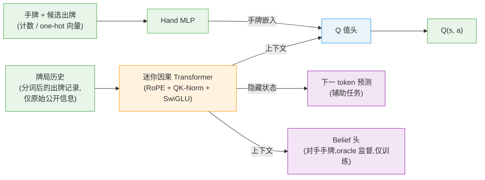

# FableDan — 无特征工程、通过自对弈强化学习训练的掼蛋 AI

FableDan 是一套从零开始训练 **掼蛋(GuanDan)** 的完整框架。掼蛋是一款四人两队的
斗牌类纸牌游戏。FableDan 完全从 **原始的、分词的牌局历史** 学习(谁在什么时候出了
什么牌、按顺序排列),**不依赖任何手工设计的特征,也没有任何领域先验**。一个迷你
Llama 风格的因果 Transformer 阅读逐手牌局记录,一个 Q 头为每个合法出牌打分,
通过深度蒙特卡洛(DMC)自对弈训练。

整个流水线都包含在此仓库中:规则引擎、分词器、PyTorch 训练模型、无依赖的 NumPy
推理模型、DMC 自对弈训练器、评估框架,以及一个可直接提交的
[Botzone](https://www.botzone.org.cn/) 机器人。

> **注意.** 这是一个为参与 Botzone 掼蛋天梯而做的研究/业余项目。代码经过充分测试
> (见 `tests/`),但仍可能存在 bug。最终天梯排名主要取决于你投入多少算力和时间——
> 见下文《诚实的预期》。

---

## 核心思想

大多数强牌类 AI 智能体(DouZero、DanZero、PerfectDou、Suphx 等)依赖**精心设计的
状态特征**,内置了大量领域知识——预计算的统计量、剩余牌记账,以及其他"次级"信息。

FableDan 遵循 DanLM 推广的方向——*让原始牌局历史自己说话*。模型输入只有:

1. **分词后的出牌历史**(约 48 个 token 的小词表:玩家、出牌类型、声称的牌级、
   进贡/还贡事件),以及
2. 当前手牌和候选出牌的**计数/one-hot 向量**。

所有重要的信息——记牌、谁有威胁、何时该炸——都通过自对弈和一个辅助的
下一 token 预测目标从头学习。

| 方面 | 手工特征 SOTA(如 DanZero) | FableDan |
| ---- | -------------------------- | -------- |
| 状态特征 | 数百维手工特征 | 原始 token 序列(~48 词表) |
| 编码器 | MLP | 迷你因果 Transformer + MLP |
| 领域知识 | 有 | 无 |
| 训练信号 | DMC 自对弈 | DMC 自对弈 + NTP(+ belief) |

---

## 架构



- **编码器**:一个小的(默认 4 层块)Llama 风格因果 Transformer
  (`d_model=128`,RoPE 位置编码,QK-Norm,RMSNorm,SwiGLU FFN),输入是历史 token
  流。最后一个位置的隐藏状态作为上下文向量。
- **Hand MLP**:编码每个出牌的计数/one-hot 特征向量。
- **Q 头**:拼接上下文 + 手牌嵌入,为每个合法出牌回归一个标量 Q 值;
  贪心动作 = argmax Q。
- **辅助头(仅训练使用,推理时丢弃):**
  - **下一 token 预测(NTP)**:与 DanLM 一致,在牌局历史上做预测。
  - **Belief 头** —— 用 oracle 标签预测其他三位玩家隐藏手牌的点数分布。
    这促使编码器学到精确的记牌能力(Suphx oracle 引导 / PerfectDou 完美信息
    蒸馏的轻量版)。DanLM 没有这个头。

推理是**纯 NumPy 重实现**(`fabledan/model_np.py`),直接镜像训练好的权重,
因此部署**零重依赖**,可以舒适地跑在 Botzone 沙箱内。

---

## 仓库结构

```
fabledan/
  cards.py        Card 编码(Botzone id 0..107),级牌排序
  combos.py       出牌枚举(含"配子"通配用法),beats()、claim 解析
  engine.py       单局引擎:发牌/进贡/还贡/抗贡/接风/双下,奖励 ±1/±2/±3
  encode.py       历史分词器(词表 48)+ 手牌/动作特征
  model_torch.py  PyTorch Q 网络(训练;Transformer + MLP + NTP + belief 头)
  model_np.py     纯 NumPy 推理模型(部署 / 快速评估)
  ring.py         RingRunner:并发多局、批处理决策请求
  train_fast.py   DMC 自对弈训练器(CPU actor + 批量 GPU 推理 + GPU learner)
  train.py        经验回放缓冲 + 单进程训练工具
  train_demo.py   迷你 NumPy MLP DMC 训练器(无需 PyTorch 验证整个流水线)
  agents.py       Random / Rule / Torch / NumPy 智能体
  evaluate.py     面对面评估(队伍换座、随机级牌/进贡)
botzone/
  bot_fabledan.py Botzone 机器人入口(JSON 协议,NumPy 推理)
  local_judge.py  本地 Botzone 裁判模拟器,用于协议/合法性测试
  pack_bot.py     打包提交用 zip
ui/               网页对战 UI(FastAPI + 静态前端,见下文《网页对战 UI》)
  server.py       FastAPI 服务器(API 端点 + 静态文件)
  game_manager.py 游戏会话管理(单局 / 整局模式、状态序列化)
  ui_agent.py     智能体注册表(rule / random / ckpts 模型 + 提示 Q 值)
  static/         前端(index.html / app.js / style.css,macOS 风格界面)
tests/
  test_all.py     引擎不变量、claim 往返、编码、RingRunner 冒烟测试
```

> 训练权重、checkpoint、打包 zip 和参考论文**不纳入 git 跟踪**(见 `.gitignore`)。
> 用下面的命令自己训练。

---

## 安装

```bash
# 仅推理 / 评估 / Botzone 机器人:
pip install numpy

# 训练(PyTorch 模型):
pip install torch numpy

# 网页 UI:
pip install fastapi uvicorn
```

建议使用 Python 3.10+。训练在 CUDA GPU 上收益很大;NumPy 演示训练器和所有推理
在 CPU 上运行也很流畅。

---

## 快速开始

在仓库根目录运行所有命令。

```bash
# 1. 健全性测试(引擎不变量、claim 往返、编码、RL 循环)
python tests/test_all.py

# 2. 用 DMC 自对弈训练一个迷你 NumPy MLP——无需 PyTorch,端到端验证整个流水线
#    (数千局即可达到 vs random 约 80-90%)
python -m fabledan.train_demo

# 3. 让任意两个智能体面对面评估(换座、随机级牌/进贡)
python -m fabledan.evaluate --a rule   --b random --games 200
python -m fabledan.evaluate --a ckpts/run1/best.npz --b rule --games 500
```

`--a` / `--b` 接受 `random`、`rule`、`*.npz`(NumPy)或 `*.pt`(PyTorch)checkpoint。

---

## 网页对战 UI —— 在浏览器里和 AI 对打!

FableDan 自带一个参照 DanLM 网页 UI 架构开发、采用 macOS 风格外观的界面,可在
浏览器中直接游玩掼蛋,支持 AI 提示(显示每个合法出牌的 Q 值估计)、AI 托管、手牌
排序等。

```bash
python -m uvicorn ui.server:app --host 0.0.0.0 --port 8000
# 浏览器打开 http://localhost:8000
```

> 也可直接运行 `start_ui.bat`(Windows)。

### 可选 AI 智能体

- **FableDan Rule** — 贪心规则基线(默认)
- **Random** — 完全随机
- **Model …** — 从 `ckpts/` 目录自动发现的训练模型(`.npz` / `.pt`)

### 训练好的模型如何接入 UI

1. 训练完成后,把 `.npz`(或 `.pt`)权重文件放进仓库根目录的 `ckpts/` 文件夹
   (例如 `ckpts/run1/best.npz`)。
2. 重启 UI 服务器,开始界面的「AI 模型」下拉框会自动出现该模型。
3. 选中模型后:开启「AI提示」可看到每个合法出牌的 Q 值;开启「AI托管」则由该
   模型自动出牌。

### UI 功能一览

- **随机单局**:随机级牌 + 随机进贡的一局。
- **完整对局(2 到 A)**:从 2 一路升级到 A,按上一局名次自动进贡/还贡/抗贡。
- **出牌 / 过 / 取消**:点击手牌选择,「出牌」打出;配子(红桃级牌)有多种解释时
  弹出选择器。
- **AI 提示**:显示 top-3 推荐出牌及其 Q 值,点击直接选中。
- **AI 托管**:让所选智能体替你打。
- **排序**:手牌升/降序切换,支持拖拽自定义排序。
- **中 / EN 双语**界面。

---

## 完整训练(PyTorch,GPU)

`train_fast` 采用 DanLM 风格设置:CPU actor 进程并发运行多局,把批量决策请求发给
专门的 GPU 推理服务,learner 进程做梯度更新并每轮广播最新权重。

```bash
# 单 GPU
python -m fabledan.train_fast --out ckpts/run1 --actors 16

# 双 GPU(一个做推理、一个做训练)—— 和 DanLM 一样
python -m fabledan.train_fast --out ckpts/run1 --actors 24 \
    --infer-device cuda:0 --device cuda:1

# 从 checkpoint 恢复
python -m fabledan.train_fast --out ckpts/run1 --resume ckpts/run1/latest.pt
```

常用参数:`--n-blocks`(编码器深度,默认 4)、`--ntp-weight`(默认 0.02)、
`--belief-weight`(默认 0.05,设为 `0` 关闭)、`--batch`、`--actors`、
`--max-decisions`(GPU 批大小)、`--max-hours`(自动停止 + 最终导出)。每当评估
创新高,训练器会自动导出 NumPy `best.npz` 并打包好可直接上传的 Botzone zip。

训练器会报告两个指标:**对规则基线的胜率**(早期就会饱和)和**对冻结自快照的胜率**
——一旦规则胜率见顶,快照数字才是可靠的"还在变强"标尺。

---

## 部署到 Botzone

完整步骤见 [UPLOAD_GUIDE.md](UPLOAD_GUIDE.md)。简单说:

```bash
# 把权重内嵌进 zip(最简单,若在源码大小限制内)
python botzone/pack_bot.py --weights ckpts/run1/best.npz --embed-weights
# -> dist/fabledan_bot.zip  (在掼蛋游戏里作为 python3 机器人上传)
```

机器人零依赖(只用 Botzone 提供的 NumPy),使用 JSON 协议,支持常驻模式,
权重在首回合加载一次。实测单次决策推理约 20-40 ms,远在单回合时限内。

---

## 相比基线配方,FableDan 增加了什么

DanLM 风格配方是*原始历史分词 + 迷你 Transformer + DMC 自对弈 + NTP*,外加大量
算力。FableDan 保留这些,并加入几项旨在从每个样本中榨取更多价值的东西;
完整路线图见 [DESIGN.md](DESIGN.md)。

- **Belief 辅助头** —— oracle 监督的对手手牌预测,迫使编码器学到精确记牌
  (已实现,默认开启)。
- **略深的编码器**(4 层块),带 QK-Norm + RoPE + SwiGLU。
- **Top-k ε-greedy 探索** —— 只在模型最好的出牌中探索,绝不选明显差的。
- **冻结快照影子评估** —— 检测自对弈停滞。

计划中 / 已搭好脚手架:用 TD-λ 混合目标降低 DMC 方差、对手池/联赛避免被利用性
崩溃、部署时用 belief 头做单步前瞻搜索、模型缩放与蒸馏。

---

## 诚实的预期

架构上的改进放大了每个样本的价值,但自对弈 RL 的硬通货仍然是**算力 × 时间**。
达到 DanLM 级别的经验量需要认真的 GPU 天数。现实的节奏是:训练一两天,先上传
第一个版本(一旦对规则基线超过约 95%),拿到初始天梯名次,然后持续训练、持续
重传。把它当作一个持续进行的过程,而不是一次性提交。

---

## 训练时长参考(实测)

| 场景 | 需要时间 | 达到的水平 |
| ---- | -------- | ---------- |
| `train_demo`(CPU,无 PyTorch) | 约 25-35 分钟(默认 3000 局) | vs random 约 80-90% |
| `train_fast` 单 GPU | 约 1-2 天 | vs rule 约 95%+,可上 Botzone |
| 逼近 DanLM 级别 | GPU 数日 | 天梯上游 |

> 以上为作者机器上的实测与项目文档给出的经验值,随硬件不同会有浮动。

---

## 参考资料

- **DanLM** —— 基于分词、无特征工程的掼蛋/斗地主智能体,本项目表示的灵感来源。
  <https://github.com/dashidhy/DanLM>
- **DanZero** —— Lu et al., "DanZero: Mastering GuanDan Game with Reinforcement
  Learning", AAAI 2023. <https://arxiv.org/abs/2210.17087>
- **DouZero** —— Zha et al., "DouZero: Mastering DouDizhu with Self-Play Deep
  Reinforcement Learning", ICML 2021. <https://arxiv.org/abs/2106.06135>
- **PerfectDou** —— Yang et al., "PerfectDou: Dominating DouDizhu with Perfect
  Information Distillation", NeurIPS 2022. <https://arxiv.org/abs/2203.16406>
- **Suphx** —— Li et al., "Suphx: Mastering Mahjong with Deep Reinforcement
  Learning", 2020. <https://arxiv.org/abs/2003.13590>

---

## 许可证

Apache License 2.0 附带额外的非商业限制——学术研究和个人使用免费;商业使用需
作者书面许可。详见 [LICENSE](LICENSE)。